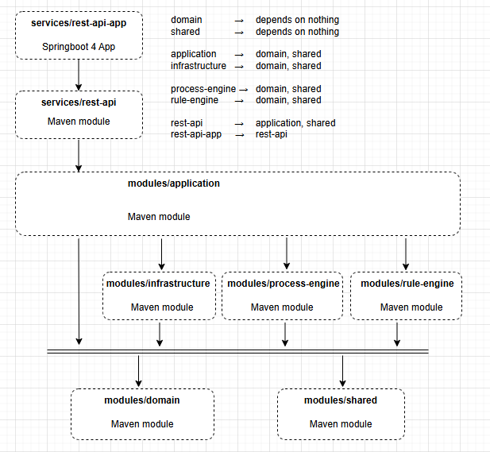
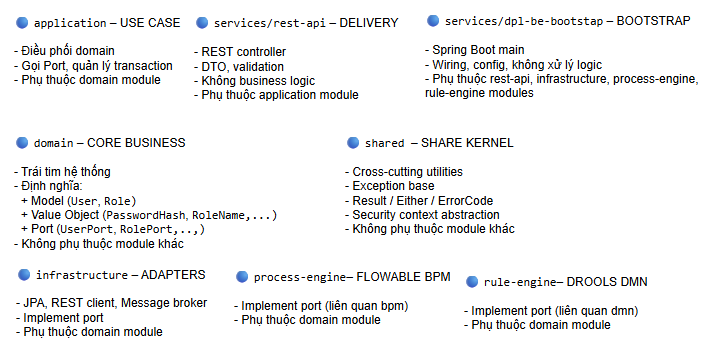

# buuhq: msc thesis uit-is
# Author: BuuHQ
# Date: Jan 2026

# DESIGN AND EVALUATION OF A BUSINESS PROCESS DIGITALIZATION PLATFORM BASE ON PROCESS ENGINE, RULE ENGINE, AND AI-SUPPORTED BUSINESS RULE RECOMMENDATION

# Stack:
- Backend: Java Spring Boot, Flowable BPM, Drools Rule Engine, Python Flask for AI services
- Frontend: Next.js, React, Tailwind CSS
- AI/ML: Python, TensorFlow, scikit-learn
- Database: PostgreSQL, MongoDB
- DevOps: Docker, Kubernetes, Jenkins, GitLab CI/CD

# Backend Architecture:

